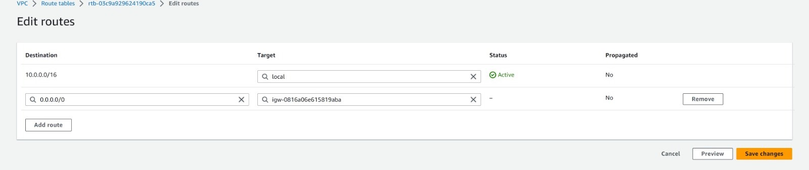

# Setting Up a VPC with Two-Tier Architecture

In this guide, we will walk through the steps to set up a Virtual Private Cloud (VPC) with a two-tier architecture in AWS. The two-tier architecture consists of a public subnet and a private subnet, allowing for better network segregation and security.

## Prerequisites

Before getting started, make sure you have the following:

- An AWS account with appropriate permissions to create VPC resources.
- Basic familiarity with AWS services such as EC2, VPC, and Subnets.
- The AWS Command Line Interface (CLI) installed on your local machine (optional, but helpful for command-line instructions).

## Steps

Follow these steps to set up a VPC with a two-tier architecture:

### 1. Create a VPC

1. Go to the AWS Management Console and navigate to the VPC service.
2. Click on "Create VPC" and provide the necessary details, such as the VPC name, IPv4 CIDR block, and tenancy.
3. Ensure that you select an IPv4 CIDR block that is not overlapping with any existing networks.
4. Click "Create" to create the VPC.

### 2. Create Subnets

1. Inside the newly created VPC, click on "Subnets" in the sidebar.
2. Click on "Create subnet" and provide the following details:
   - Name: Give a name to the subnet.
   - VPC: Select the VPC you created in the previous step.
   - Availability Zone: Choose an availability zone for the subnet.
   - IPv4 CIDR block: Specify the subnet's CIDR block.
3. Repeat the above steps to create both the public and private subnets.

### 3. Configure Route Tables

1. In the VPC dashboard, navigate to "Route Tables" in the sidebar.
2. Select the default route table associated with your VPC.
3. Add the following routes to the route table:
   - Public Subnet Route:
     - Destination: `0.0.0.0/0`
     - Target: Internet Gateway (IGW)
   - Private Subnet Route:
     - Destination: `0.0.0.0/0`
     - Target: NAT Gateway or NAT Instance (for internet access from private subnet)
4. Associate the public subnet with the default route table.

### 4. Set Up Internet Gateway (IGW)

1. In the VPC dashboard, go to "Internet Gateways" in the sidebar.
2. Click on "Create internet gateway" and provide a name for the gateway.
3. Select the newly created internet gateway and click on "Attach to VPC".
4. Choose the VPC you created earlier and attach the gateway.

### 5. Launch Instances

1. Launch an EC2 instance in the public subnet to serve as a bastion host or jump box. This will allow SSH/RDP access to the private instances.
2. Launch one or more EC2 instances in the private subnet for your application servers or backend resources.

### 6. Security Group Configuration

1. Create security groups for your instances:
   - Bastion Host Security Group: Allow inbound SSH/RDP access from your IP address or specific source IP ranges.
   - Application Server Security Group: Allow inbound access from the bastion host security group for necessary protocols and ports.
2. Associate the security groups with the respective instances.

### 7. Accessing the Instances

To access the private instances from your local machine:

1. SSH/RDP into the bastion host using its public IP address.
2. Once connected to the bastion host, use SSH/RDP to connect to the private instances using their private IP addresses.

## Conclusion

By following the steps outlined in this guide, you have successfully set up a VPC with a two-tier architecture in AWS. This architecture provides improved security and network segmentation, with public and private subnets serving different purposes. Make sure to configure the appropriate security group rules and access controls for your instances based on your application requirements.
